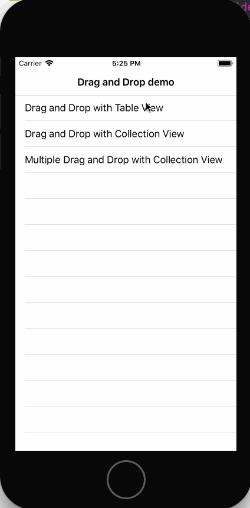
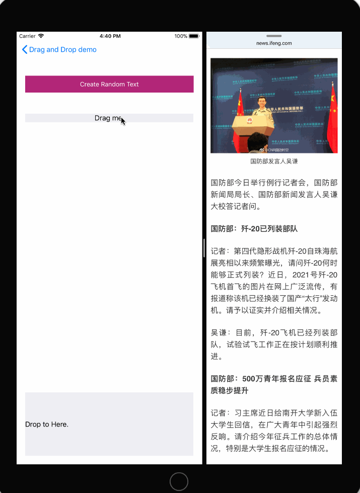

# iOS11-Drag-and-Drop

iOS11 Drag and Drop功能的简单演示

## Feature

- UITableView中利用Drag and Drop功能进行排序
- UICollectionView中利用Drag and Drop功能进行排序
- 把数据从一个UICollectionView中复制到另一个UICollectionView中，并且支持拖放多个数据
- UILabel通过Drag and Drop展示新文本

## Requirements

- Xcode9.0+
- iOS11.0+
- Swift4.0+

## Preview

## License

基于MIT License进行开源，详细内容请参阅`LICENSE`文件。
